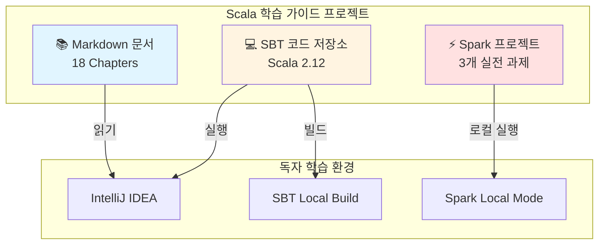

# Scala 학습 가이드 Architecture Document

## Introduction

This document outlines the overall project architecture for Scala 학습 가이드, including backend systems, shared services, and non-UI specific concerns. Its primary goal is to serve as the guiding architectural blueprint for AI-driven development, ensuring consistency and adherence to chosen patterns and technologies.

**Relationship to Frontend Architecture:**
If the project includes a significant user interface, a separate Frontend Architecture Document will detail the frontend-specific design and MUST be used in conjunction with this document. Core technology stack choices documented herein (see "Tech Stack") are definitive for the entire project, including any frontend components.

### Starter Template or Existing Project

**N/A** - 이 프로젝트는 학습 가이드북 작성이므로 소프트웨어 스타터 템플릿을 사용하지 않습니다.

**코드 예제 저장소:**
- Monorepo 구조 (단일 GitHub 저장소)
- SBT 멀티 프로젝트 설정
- Part/Chapter별 독립적 빌드 및 실행 가능

### Change Log

| Date | Version | Description | Author |
|------|---------|-------------|--------|
| 2025-10-02 | v1.0 | 초안 작성 - Introduction 섹션 완료 | BMad Master |

## High Level Architecture

### Technical Summary

이 프로젝트는 **교육 콘텐츠 기반 아키텍처**로, 전통적인 소프트웨어 시스템이 아닌 학습 자료와 실습 코드의 조합입니다.

**핵심 구성 요소:**
- **문서 콘텐츠**: Markdown 기반 18개 챕터 (300-400페이지)
- **실습 코드**: Scala 2.12 기반 예제 코드 (SBT 프로젝트)
- **실전 프로젝트**: Apache Spark 3개 프로젝트 (로그분석, 스트리밍, ML)

**아키텍처 특성:**
- Monorepo 구조로 문서와 코드 통합 관리
- 각 챕터는 독립적으로 학습 및 실행 가능
- 코드 예제는 자동화된 테스트로 검증 (ScalaTest)

**PRD 목표와의 연계:**
- 7-9주 학습 목표 달성을 위한 점진적 난이도 설계
- Java 개발자 친화적 구조 (Java 비교 예제 필수)
- Spark 실무 적용 능력 배양을 위한 3-tier 프로젝트

### High Level Overview

**1. 아키텍처 스타일:**
- **교육 콘텐츠 아키텍처** (Documentation + Code Examples)
- Monorepo 기반 통합 저장소

**2. Repository 구조 (from PRD):**
- **Monorepo**: 단일 GitHub 저장소에 문서와 코드 통합
- Part별 디렉토리 분리 → Chapter별 SBT 서브 프로젝트

**3. 서비스 아키텍처:**
- N/A (학습 가이드북이므로 서비스 배포 없음)
- 로컬 환경에서만 실행 (SBT, Spark Local/Standalone Mode)

**4. 독자 학습 플로우:**
```
[Part 1: 기본문법] → [Part 2: 함수형] → [Part 3: 고급기능]
                                          ↓
                              [Part 4: Spark 프로젝트]
                                          ↓
                              [Part 5: 생태계/도구]
```

**5. 주요 아키텍처 결정:**
- **Scala 2.12 기준**: 팀 프로젝트 호환성 (Scala 3 차이점은 주석으로)
- **SBT 멀티 프로젝트**: 챕터별 독립 빌드/테스트
- **자동화된 코드 검증**: 모든 예제는 컴파일 및 테스트 통과 필수
- **A4 페이지 레이아웃**: 향후 PDF 변환 대비

### High Level Project Diagram



### Architectural and Design Patterns

학습 가이드북이므로 전통적인 소프트웨어 패턴보다는 **교육 설계 패턴**이 적용됩니다:

**교육 설계 패턴:**

- **점진적 복잡도 증가 (Progressive Complexity):** Part 1 → Part 5로 갈수록 난이도 상승
  - _근거_: 성인 학습 이론(Adult Learning Theory)의 Scaffolding 원칙

- **실습 우선 학습 (Hands-On First):** 이론 설명 후 즉시 실행 가능한 코드 예제 제공
  - _근거_: 구성주의 학습(Constructivism), PRD FR2 요구사항 반영

- **비교 학습 (Comparative Learning):** 모든 개념에 Java 대조 예제 포함
  - _근거_: 전이 학습(Transfer Learning) 효과, Java 개발자 대상

- **프로젝트 기반 학습 (Project-Based Learning):** Part 4에서 3개 실전 프로젝트
  - _근거_: 문제 중심 학습(Problem-Based Learning), Spark 실무 역량 목표

**코드 아키텍처 패턴 (예제 코드에 적용):**

- **Repository Pattern:** 데이터 접근 추상화 (Spark 프로젝트)
- **Immutability by Default:** 함수형 프로그래밍 원칙 강조
- **Type-Driven Design:** Scala 타입 시스템 활용 예제

## Tech Stack

### Technology Stack Table

| Category | Technology | Version | Purpose | Rationale |
|----------|-----------|---------|---------|-----------|
| **문서 포맷** | Markdown | GFM | 학습 가이드 문서 작성 | 가독성, Git 버전 관리, 향후 PDF/HTML 변환 용이 |
| **다이어그램** | Mermaid.js | 10.x | 아키텍처 및 플로우 다이어그램 | 코드로 다이어그램 작성, Markdown 임베딩 가능 |
| **언어** | Scala | 2.12.18 | 예제 코드 및 프로젝트 구현 | 팀 프로젝트 호환성, Spark 3.5.x 지원 |
| **빌드 도구** | SBT | 1.9.x | Scala 프로젝트 빌드 및 의존성 관리 | Scala 표준 빌드 도구, 멀티 프로젝트 지원 |
| **테스팅** | ScalaTest | 3.2.x | 코드 예제 자동 검증 | Scala 커뮤니티 표준, 다양한 테스트 스타일 지원 |
| **Property Testing** | ScalaCheck | 1.17.x (선택) | 속성 기반 테스팅 | 함수형 프로그래밍 테스트 강화 (Part 2 심화, 선택 학습) |
| **코드 포매팅** | Scalafmt | 3.7.x | 코드 스타일 일관성 유지 | 자동 포매팅, 커스터마이징 가능 |
| **로깅** | SLF4J + Logback | SLF4J 2.x, Logback 1.4.x | Spark 프로젝트 로깅 | Spark 기본 로깅 스택, Java 생태계 표준 |
| **Big Data** | Apache Spark | 3.5.x | Part 4 실전 프로젝트 | Scala 2.12 호환, 최신 안정 버전 |
| **모니터링** | Spark UI | 내장 (Spark 3.5.x) | Spark 작업 디버깅 및 성능 분석 | 로컬 디버깅 필수 도구, 별도 설치 불필요 |
| **런타임** | JVM | Java 11 LTS | Scala 실행 환경 | 안정성, 장기 지원, Spark 호환 |
| **IDE** | IntelliJ IDEA | Community/Ultimate | 개발 환경 (권장) | Scala Plugin 우수, 디버깅 지원 |
| **버전 관리** | Git | 2.x | 문서 및 코드 이력 관리 | 업계 표준, GitHub 호스팅 |
| **문서 변환** | mdBook 또는 Pandoc | Latest | Markdown → PDF/HTML 변환 | 향후 출판 지원 (mdBook: 웹북, Pandoc: PDF) |

### Cloud Infrastructure

**N/A** - 이 프로젝트는 로컬 환경에서만 실행되며, 클라우드 인프라를 사용하지 않습니다.

독자는 다음 환경에서 학습합니다:
- **로컬 개발 환경**: macOS, Linux, Windows 10+
- **Spark 실행 모드**: Local Mode 또는 Standalone Mode
- **데이터셋 저장**: GitHub 저장소 또는 로컬 파일 시스템

### Technology Selection Rationale

**핵심 결정 사항:**

1. **Scala 2.12.18**
   - ✅ 독자 팀 프로젝트 호환성 (즉시 실무 적용 가능)
   - ✅ Spark 3.5.x 공식 지원
   - ⚠️ Scala 3.x 마이그레이션 경로: 주요 차이점 주석으로 제공

2. **SBT 1.9.x**
   - ✅ Scala 표준 빌드 도구
   - ✅ 멀티 프로젝트 지원 (18개 챕터 독립 관리)
   - ⚠️ 빌드 속도: 챕터별 독립 빌드, 병렬 컴파일로 완화

3. **ScalaTest + ScalaCheck**
   - ✅ ScalaTest: 코드 예제 검증 필수 (PRD NFR2)
   - ✅ ScalaCheck: 함수형 프로그래밍 심화 (선택 학습)

4. **Logging & Monitoring**
   - ✅ SLF4J + Logback: Spark 프로젝트 디버깅 필수
   - ✅ Spark UI: 로컬 작업 모니터링 (http://localhost:4040)

5. **문서 변환 도구**
   - ✅ mdBook: 웹북 형태 제공 (Rust Book 스타일)
   - ✅ Pandoc: PDF 출판 지원
   - ⚠️ 현재는 Markdown 원본 유지, 향후 출판 시 사용

## Data Models

이 프로젝트는 런타임 데이터베이스가 없으므로, 전통적인 데이터 모델 대신 **콘텐츠 구조 모델**을 정의합니다.

### Chapter (챕터)

**Purpose:** 학습 가이드의 기본 학습 단위

**Key Attributes:**
- `chapter_id`: String - 챕터 식별자 (예: "chapter-01-getting-started")
- `part_id`: String - 소속 Part (예: "part1-basics")
- `title`: String - 챕터 제목 (한글)
- `estimated_pages`: Int - 예상 페이지 수 (15-25 페이지)
- `learning_objectives`: List[String] - 학습 목표 (3-5개)
- `prerequisites`: List[String] - 선행 챕터 (선택)
- `code_examples_count`: Int - 포함된 코드 예제 개수

**Relationships:**
- `belongs_to`: Part (1:N)
- `has_many`: CodeExample (1:N)
- `has_many`: Exercise (1:N, 선택적)

### CodeExample (코드 예제)

**Purpose:** 실행 가능한 Scala 코드 예제

**Key Attributes:**
- `example_id`: String - 예제 식별자
- `file_path`: String - SBT 프로젝트 내 파일 경로
- `language`: String - "scala" 또는 "java" (비교 예제)
- `executable`: Boolean - 단독 실행 가능 여부
- `test_file_path`: String - 대응하는 ScalaTest 파일
- `description`: String - 예제 설명

**Relationships:**
- `belongs_to`: Chapter (N:1)
- `compares_with`: CodeExample (선택, Java 비교)

### SparkProject (Spark 실전 프로젝트)

**Purpose:** Part 4의 3개 실전 프로젝트

**Key Attributes:**
- `project_id`: String - 프로젝트 식별자
- `name`: String - 프로젝트명 (예: "로그 분석 시스템")
- `dataset_source`: String - 데이터셋 출처 (Kaggle, 합성 등)
- `dataset_size_mb`: Int - 데이터셋 크기
- `spark_modules`: List[String] - 사용할 Spark 모듈 (spark-core, spark-sql, spark-mllib)
- `estimated_completion_hours`: Int - 예상 완료 시간

**Relationships:**
- `belongs_to`: Part 4 (Chapter 15)
- `has_many`: CodeExample (1:N)

### Part (파트)

**Purpose:** 5개 Part 구조 (PRD Epic 매핑)

**Key Attributes:**
- `part_id`: String - Part 식별자 (예: "part1-basics")
- `title`: String - Part 제목
- `epic_id`: String - PRD Epic 매핑 (예: "E1")
- `estimated_pages`: Int - 예상 페이지 수
- `priority`: String - P0, P1, P2

**Relationships:**
- `has_many`: Chapter (1:N)
- `maps_to`: Epic (1:1, PRD 참조)

## Source Tree

프로젝트는 Monorepo 구조로 문서와 코드를 통합 관리합니다.

```
scala-guide/
├── docs/                           # 학습 가이드 문서 (Markdown)
│   ├── prd.md                     # Product Requirements Document
│   ├── architecture.md            # Architecture Document (본 문서)
│   ├── progress.md                # 진행 상황 추적
│   ├── part1-basics/              # Part 1 챕터 문서
│   │   ├── chapter01-getting-started.md
│   │   ├── chapter02-variables-types.md
│   │   ├── chapter03-control-structures.md
│   │   ├── chapter04-functions.md
│   │   ├── chapter05-oop.md
│   │   └── chapter06-collections-basics.md
│   ├── part2-functional/          # Part 2 챕터 문서
│   │   ├── chapter07-fp-concepts.md
│   │   ├── chapter08-higher-order-functions.md
│   │   ├── chapter09-collections-advanced.md
│   │   └── chapter10-pattern-matching.md
│   ├── part3-advanced/            # Part 3 챕터 문서
│   │   ├── chapter11-type-system.md
│   │   ├── chapter12-implicits.md
│   │   └── chapter13-concurrency.md
│   ├── part4-spark/               # Part 4 챕터 문서
│   │   ├── chapter14-spark-basics.md
│   │   └── chapter15-spark-projects.md
│   └── part5-ecosystem/           # Part 5 챕터 문서
│       ├── chapter16-sbt.md
│       ├── chapter17-testing.md
│       └── chapter18-java-interop.md
│
├── code/                          # 실습 코드 (SBT 프로젝트)
│   ├── build.sbt                  # 루트 SBT 설정 (멀티 프로젝트)
│   ├── project/
│   │   ├── build.properties      # SBT 버전
│   │   └── plugins.sbt           # SBT 플러그인 (Scalafmt 등)
│   ├── part1-basics/
│   │   ├── chapter01/            # Chapter 1 예제
│   │   │   ├── src/main/scala/
│   │   │   │   ├── HelloWorld.scala
│   │   │   │   └── ReplExamples.scala
│   │   │   └── src/test/scala/
│   │   │       └── HelloWorldSpec.scala
│   │   ├── chapter02/            # Chapter 2 예제
│   │   │   ├── src/main/scala/
│   │   │   │   ├── VariablesExample.scala
│   │   │   │   └── TypeInferenceExample.scala
│   │   │   └── src/test/scala/
│   │   │       └── VariablesSpec.scala
│   │   └── ...                   # Chapter 3-6
│   ├── part2-functional/
│   │   └── ...                   # Chapter 7-10
│   ├── part3-advanced/
│   │   └── ...                   # Chapter 11-13
│   ├── part4-spark/
│   │   ├── chapter14/
│   │   │   └── src/main/scala/
│   │   │       ├── RDDExamples.scala
│   │   │       ├── DataFrameExamples.scala
│   │   │       └── SparkSQLExamples.scala
│   │   └── chapter15/            # 3개 실전 프로젝트
│   │       ├── project1-log-analysis/
│   │       │   ├── src/main/scala/
│   │       │   │   └── LogAnalysisApp.scala
│   │       │   ├── src/test/scala/
│   │       │   └── data/         # 샘플 데이터셋
│   │       ├── project2-streaming/
│   │       │   └── ...
│   │       └── project3-ml-pipeline/
│   │           └── ...
│   └── part5-ecosystem/
│       └── ...                   # Chapter 16-18
│
├── .scalafmt.conf                # Scalafmt 설정
├── .gitignore                    # Git ignore 설정
├── README.md                     # 프로젝트 소개
└── LICENSE                       # 라이선스
```

**주요 설계 결정:**

1. **docs/ vs code/ 분리**
   - 문서와 코드 명확히 구분
   - 독자는 docs/에서 읽고, code/에서 실습

2. **Part별 디렉토리**
   - PRD Epic 구조 반영
   - 각 Part는 독립적으로 학습 가능

3. **Chapter별 SBT 서브 프로젝트**
   - build.sbt에서 각 챕터를 독립 프로젝트로 정의
   - 예: `lazy val chapter01 = project.in(file("part1-basics/chapter01"))`

4. **테스트 구조**
   - src/main/scala: 예제 코드
   - src/test/scala: 검증 테스트 (ScalaTest)
   - 1:1 매핑 원칙

5. **Spark 프로젝트 data/ 디렉토리**
   - 샘플 데이터셋 포함 (작은 크기)
   - 대용량 데이터셋은 다운로드 스크립트 제공

## Coding Standards

이 섹션은 AI 에이전트와 협업자가 예제 코드를 작성할 때 따라야 할 필수 규칙입니다.

### Core Standards

- **언어 및 버전**: Scala 2.12.18, Java 11 LTS
- **스타일 & 린팅**: Scalafmt 3.7.x (`.scalafmt.conf` 설정 준수)
- **테스트 조직**:
  - 테스트 파일: `src/test/scala/`
  - 명명 규칙: `{ClassName}Spec.scala`
  - 테스트 스타일: FlatSpec 또는 FunSuite

### Naming Conventions

| Element | Convention | Example |
|---------|-----------|---------|
| 클래스/트레이트 | PascalCase | `UserService`, `DataProcessor` |
| 메서드/변수 | camelCase | `getUserById`, `totalCount` |
| 상수 | UPPER_SNAKE_CASE | `MAX_RETRIES`, `DEFAULT_TIMEOUT` |
| 패키지 | 소문자, 점 구분 | `com.example.chapter01` |
| 파일명 | 클래스명과 동일 | `UserService.scala` |

### Critical Rules

**코드 예제 작성 규칙:**

- **모든 예제는 컴파일 가능해야 함**: 주석 처리된 코드도 실행 가능한 형태 유지
- **Java 비교 예제 필수**: PRD FR1 - 모든 주요 개념은 Java 대조 예제 포함
  ```scala
  // Scala 예제
  val numbers = List(1, 2, 3, 4, 5)
  val doubled = numbers.map(_ * 2)

  // Java 비교 (주석으로)
  // List<Integer> numbers = Arrays.asList(1, 2, 3, 4, 5);
  // List<Integer> doubled = numbers.stream()
  //   .map(n -> n * 2)
  //   .collect(Collectors.toList());
  ```

- **Scala 3 차이점 명시**: 주요 변경사항은 주석으로 표시
  ```scala
  // Scala 2.12
  implicit val ordering: Ordering[User] = ...

  // Scala 3: implicit -> given/using
  // given Ordering[User] = ...
  ```

- **실행 가능한 예제 우선**: 모든 예제는 `main` 메서드 또는 테스트로 실행 가능
  ```scala
  object HelloWorld extends App {
    println("Hello, Scala!")
  }
  ```

- **테스트 필수**: 모든 예제는 대응하는 ScalaTest 파일 필요
  ```scala
  // src/main/scala/HelloWorld.scala
  // src/test/scala/HelloWorldSpec.scala
  class HelloWorldSpec extends FlatSpec with Matchers {
    "HelloWorld" should "print message" in {
      // 테스트 코드
    }
  }
  ```

- **주석 작성 원칙**:
  - 한글 주석 사용 (독자 대상)
  - "무엇을"보다 "왜"를 설명
  - 복잡한 로직은 단계별 주석

- **의존성 명시**: 외부 라이브러리 사용 시 build.sbt에 버전 명시

### Scala-Specific Guidelines

**불변성 우선:**
```scala
// Good
val immutableList = List(1, 2, 3)

// Bad (필요한 경우가 아니면)
var mutableList = scala.collection.mutable.ListBuffer(1, 2, 3)
```

**타입 추론 활용, 단 가독성 우선:**
```scala
// Good - 명확한 경우 타입 생략
val count = 42
val name = "Scala"

// Good - 복잡한 경우 타입 명시
val processor: DataProcessor[User, Result] = ...
```

**패턴 매칭 활용:**
```scala
// Good
result match {
  case Success(value) => println(s"Success: $value")
  case Failure(e) => println(s"Error: ${e.getMessage}")
}

// Bad - if-else로 처리
if (result.isSuccess) {
  ...
}
```

**for-comprehension 선호 (복잡한 중첩 시):**
```scala
// Good
for {
  user <- getUser(id)
  orders <- getOrders(user)
  items <- getItems(orders)
} yield items

// Bad - 중첩 flatMap
getUser(id).flatMap { user =>
  getOrders(user).flatMap { orders =>
    getItems(orders)
  }
}
```

## Documentation Workflow

### Git Version Control

**커밋 전략:**

- **커밋 단위**: 의미 있는 작업 단위 (섹션 완성, 챕터 완료, Epic 완료 등)
- **커밋 메시지 컨벤션**:
  ```
  [Category] Brief description

  - Detailed change 1
  - Detailed change 2

  🤖 Generated with Claude Code
  Co-Authored-By: Claude <noreply@anthropic.com>
  ```

**Category 분류:**
- `[PRD]` - PRD 문서 변경
- `[Arch]` - Architecture 문서 변경
- `[Chapter N]` - 챕터 N 콘텐츠 변경
- `[Code]` - 예제 코드 추가/수정
- `[Test]` - 테스트 코드 추가/수정
- `[Spark]` - Spark 프로젝트 변경
- `[Config]` - 빌드 설정, 의존성 변경

**예시:**
```
[Chapter 1] Add Hello World example

- Add HelloWorld.scala with main method
- Add HelloWorldSpec.scala with basic tests
- Add Java comparison in comments

🤖 Generated with Claude Code
Co-Authored-By: Claude <noreply@anthropic.com>
```

### Branch Strategy

**브랜치 구조:**
- `main` - 안정 버전 (완성된 챕터만)
- `develop` - 작업 중인 내용
- `epic/part{N}` - Epic(Part) 단위 작업 브랜치
- `chapter/{N}` - 챕터 단위 작업 브랜치 (선택)

**워크플로우:**
```
develop → epic/part1 → [Chapter 1-6 작업] → PR → develop → main
```

### Tag Strategy

**버전 태그:**
- `v1.0-part1-complete` - Part 1 완료
- `v2.0-part2-complete` - Part 2 완료
- `v1.0` - 전체 가이드 v1.0 출시

### Code Quality Automation

**Pre-commit Hook (선택 사항):**
```bash
#!/bin/bash
# .git/hooks/pre-commit

echo "Running ScalaTest..."
cd code && sbt test

if [ $? -ne 0 ]; then
  echo "Tests failed. Commit aborted."
  exit 1
fi

echo "Running Scalafmt..."
sbt scalafmtCheck

if [ $? -ne 0 ]; then
  echo "Code formatting issues. Run 'sbt scalafmtAll'"
  exit 1
fi
```

### Document Writing Workflow

**챕터 작성 프로세스:**

1. **계획 단계**
   - Epic/Chapter 목표 확인 (PRD 참조)
   - 학습 목표 정의 (3-5개)
   - 예제 코드 목록 작성

2. **초안 작성**
   - Markdown 문서 작성 (docs/partN/)
   - 코드 예제 작성 (code/partN/chapterN/)
   - Java 비교 예제 추가

3. **코드 검증**
   - 모든 예제 컴파일 확인
   - ScalaTest 작성 및 실행
   - `sbt test` 통과 확인

4. **검토 및 커밋**
   - 문서 가독성 확인
   - Scala 3 차이점 주석 추가
   - Git 커밋 (커밋 컨벤션 준수)

5. **진행 상황 업데이트**
   - progress.md 업데이트
   - 완료율 기록

### Collaboration Guidelines

**AI 에이전트와 협업 시:**
- 명확한 작업 지시 (예: "Chapter 2의 변수 섹션 작성")
- 단계별 검토 (초안 → 코드 → 테스트)
- Coding Standards 준수 확인

**문서 리뷰 체크리스트:**
- [ ] 학습 목표 명확한가?
- [ ] 코드 예제 실행 가능한가?
- [ ] Java 비교 예제 포함되었는가?
- [ ] 테스트 코드 작성되었는가?
- [ ] 한글 주석 작성되었는가?
- [ ] Scala 3 차이점 표시되었는가?

## Next Steps

### Immediate Actions

1. **GitHub 저장소 초기화**
   - `git init` 실행
   - `.gitignore` 설정 (SBT, IntelliJ)
   - 초기 커밋: PRD, Architecture 문서

2. **SBT 프로젝트 구조 생성**
   - `code/` 디렉토리 생성
   - `build.sbt` 루트 설정 파일 작성
   - Part 1 Chapter 1 서브 프로젝트 생성

3. **개발 환경 설정**
   - IntelliJ IDEA Scala Plugin 설치
   - `.scalafmt.conf` 설정
   - SBT 버전 확인 (1.9.x)

### Short-term Actions (1-2주)

4. **Chapter 1 프로토타입 작성**
   - Chapter 1 "Scala 시작하기" 문서 작성
   - Hello World 예제 코드 작성
   - 테스트 코드 작성 및 검증

5. **템플릿 확립**
   - Chapter 문서 템플릿 확정
   - 코드 예제 템플릿 확정
   - 진행 상황 추적 방법 확립

### Long-term Actions

6. **Epic 1-5 순차 작성**
   - Part 1: 기본 문법 (Chapter 1-6)
   - Part 2: 함수형 프로그래밍 (Chapter 7-10)
   - Part 3: 고급 기능 (Chapter 11-13)
   - Part 4: Spark 프로젝트 (Chapter 14-15)
   - Part 5: 생태계 도구 (Chapter 16-18)

7. **최종 검토 및 출판**
   - 전체 기술 검토
   - 독자 테스트 (베타 리더)
   - mdBook/Pandoc으로 최종 변환

---

**Architecture Document v1.0 완성**

본 문서는 Scala 학습 가이드북 프로젝트의 아키텍처를 정의합니다. 모든 콘텐츠 작성과 코드 개발은 이 문서를 기준으로 진행됩니다.
